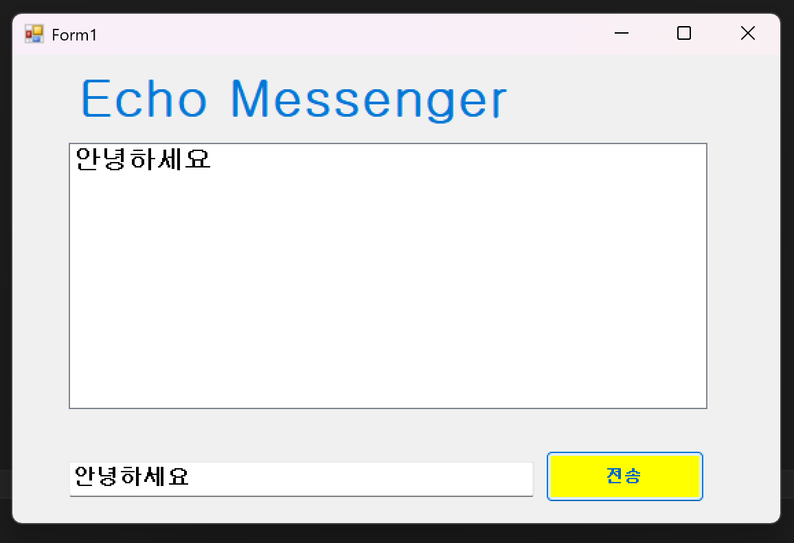
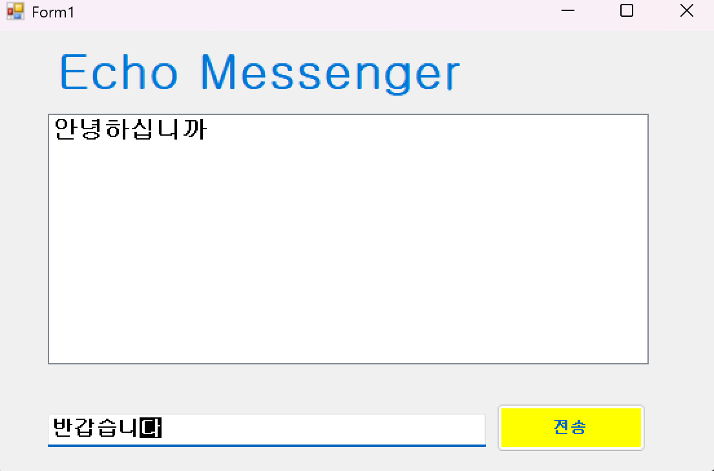
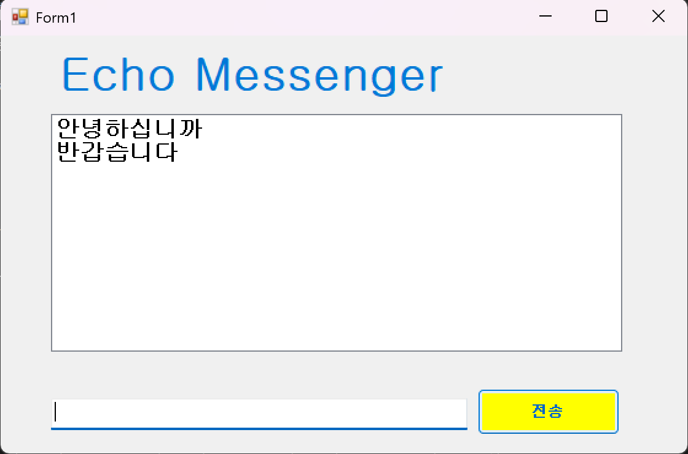
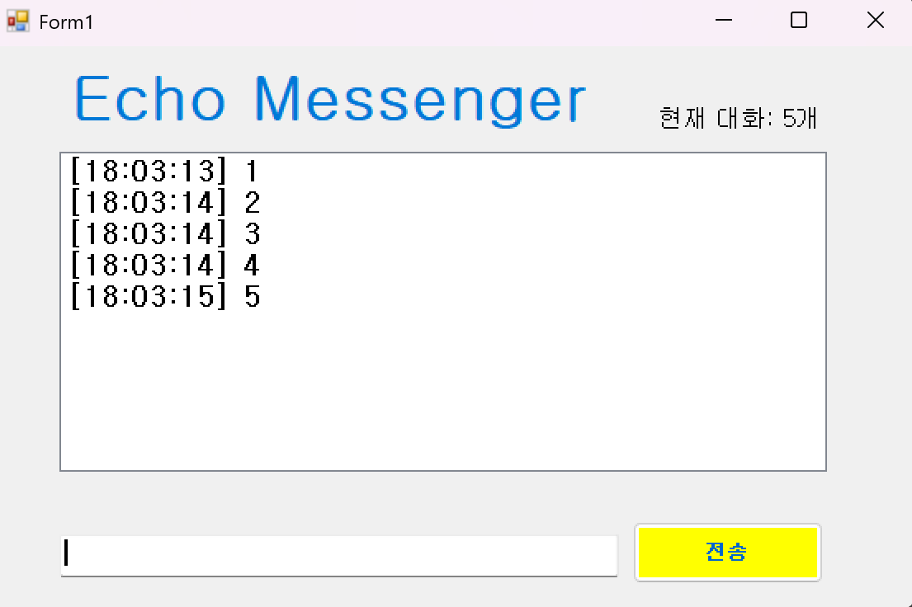
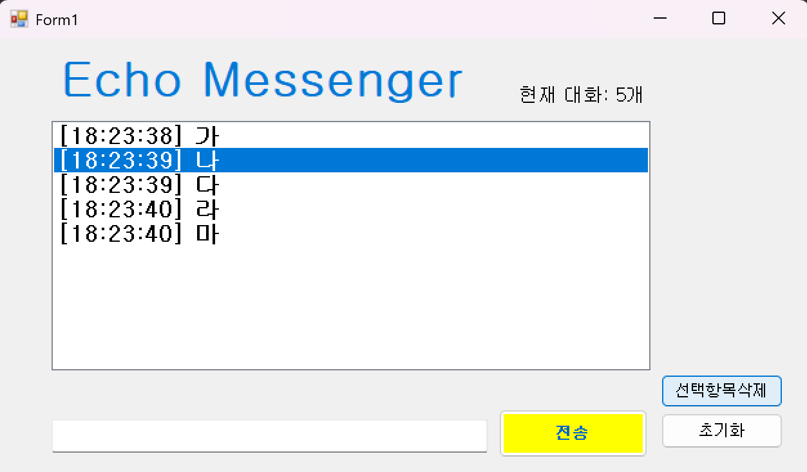
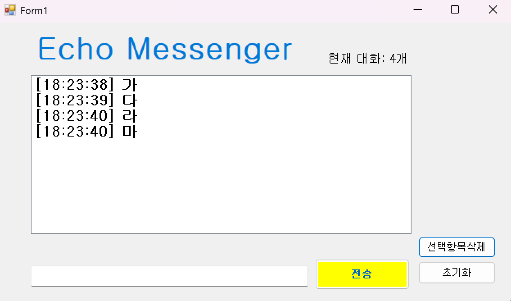
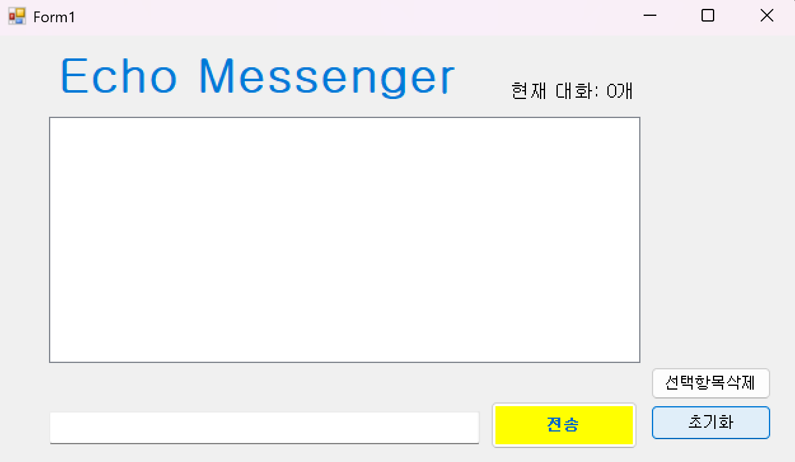
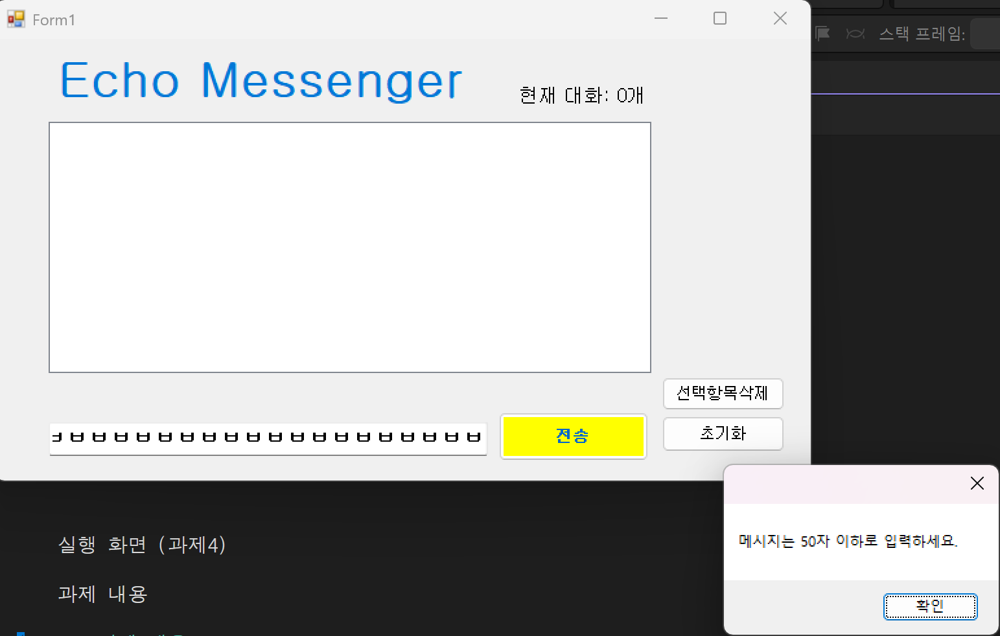

# (C# 코딩) 에코 메신저

## 개요
- C#을 활용한 Windows Forms 기반 프로그램 제작
- 1줄 소개: 사용자가 입력한 메시지를 화면에 출력하고 관리하는 간단한 메신저 프로그램
- 사용한 플랫폼: C#, .NET Windows Forms, Visual Studio, GitHub

## 사용한 컨트롤
- Label: 프로그램 제목 및 상태 표시
- TextBox: 사용자 메시지 입력
- Button: 메시지 전송 및 기능 실행
- ListBox: 대화 내용 출력 및 관리

## 사용한 기술과 구현한 기능
- Windows Forms를 이용한 UI 구성 및 배치
- 문자열(string)을 활용한 사용자 입력 처리 및 가공
- DateTime을 사용하여 메시지에 현재 시간 표시
- 이벤트 처리(버튼 클릭, 키 입력)를 통한 기능 동작 구현

## 수업 중에 배우고 사용했던 클래스들 관련된 설명
- string 클래스: 입력된 문자열을 다루고 공백 제거 및 조건 검사에 활용
- DateTime 클래스: 현재 시간을 가져와 메시지에 시간 정보를 추가하는 데 사용
- ListBox 클래스: 여러 개의 메시지를 리스트 형태로 저장하고 출력
- TextBox 클래스: 사용자 입력을 받고 제어하는 기능 담당

## 실습 중에 구현한 기능들 설명
- 사용자가 입력한 메시지를 리스트에 추가하여 대화 형태로 출력
- 메시지 전송 후 입력창을 자동으로 초기화하고 다시 입력할 수 있도록 설정
- Enter 키 입력으로도 메시지를 전송할 수 있도록 기능 추가
- 빈 값이나 공백만 입력된 경우 전송되지 않도록 처리
- 메시지 앞에 현재 시간을 붙여 가독성 향상
- 전체 메시지 개수를 화면에 표시
- 선택한 메시지를 삭제하는 기능 구현
- 전체 대화 내용을 한 번에 삭제하는 기능 추가
- 입력 가능한 글자 수를 제한하여 예외 상황 방지

실행 화면 (과제1)
-
과제 내용

-label, TextBox, Button, ListBox 컨트롤을 이용하여 기본 UI를 구성

-전송 버튼을 누르면 입력창(TextBox)에 작성한 내용이 대화 목록(ListBox)에 추가되도록 구현.

-추가 직후 TextBox의 내용을 비워(Clear) 다음 입력을 준비.

구현 내용과 기능 설명

입력창에 메시지 입력하고 전송 버튼을 누르면 메시지가 리스트 박스에 표시된다.

계속 반복하면 메시지가 리스트 박스에 한 줄씩 계속 추가된다.

추가 내용이 많아지면 리스트 박스에 스크롤바가 자동으로 생기고 스크롤된다.

실행 화면 (과제2)
-
-
 

과제 내용

### 과제 내용
- 메시지 전송 후 입력창이 자동으로 초기화되고 다시 입력할 수 있도록 포커스를 유지한다.
- Enter 키 입력만으로도 메시지를 전송할 수 있도록 기능을 추가한다.
- 빈 값이나 공백만 입력된 경우 메시지가 전송되지 않도록 예외 처리를 구현한다.

### 구현 내용과 기능 설명
- 메시지를 전송하면 입력창이 자동으로 비워지고, 커서가 다시 입력창으로 이동하도록 설정하였다.
- 키보드의 Enter 키를 눌렀을 때 버튼 클릭과 동일한 동작이 실행되도록 구현하였다.
- 공백 또는 내용이 없는 문자열은 전송되지 않도록 조건문을 통해 필터링하였다.

실행 화면 (과제3)
-

### 과제 내용
- 메시지에 타임스탬프 추가
- 메시지 개수 표시
- 문자열 공백 제거

### 구현 내용과 기능 설명
- 메시지 앞에 현재 시간이 자동으로 추가되어 출력된다.
- 리스트에 저장된 메시지 개수를 Label을 통해 실시간 표시한다.

실행 화면 (과제4)
-
기존화면
-
선택삭제 기능 추가
-
전체 초기화 기능 추가
-
50자 이상 입력 제한 기능 추가
과제 내용

### 과제 내용
- 사용자가 선택한 메시지를 개별적으로 삭제할 수 있는 기능을 구현한다.
- 버튼을 통해 전체 대화 내용을 한 번에 초기화하는 기능을 추가한다.
- 입력 가능한 메시지의 길이를 제한하여 일정 글자 수 이상 입력 시 전송되지 않도록 한다.

### 구현 내용과 기능 설명
- ListBox에서 특정 메시지를 선택한 뒤 삭제 버튼을 누르면 해당 항목만 제거되도록 구현하였다.
- 전체 삭제 버튼을 클릭하면 저장된 모든 메시지가 한 번에 지워지도록 처리하였다.
- 입력된 문자열의 길이를 검사하여 50자를 초과할 경우 메시지가 전송되지 않도록 제한하였다..

---

## 배운 내용
- Windows Forms를 활용하여 UI를 구성하고 컨트롤을 배치하는 방법을 익혔다.
- 버튼 클릭, 키 입력과 같은 이벤트를 활용한 프로그램 동작 방식을 이해하게 되었다.
- 문자열 처리 및 조건문을 활용하여 데이터를 가공하는 방법을 학습하였다.
- GitHub를 이용한 커밋과 버전 관리 과정을 경험하였다.
- 사용자 편의성을 고려한 기능 설계의 중요성을 직접 구현을 통해 느낄 수 있었다.